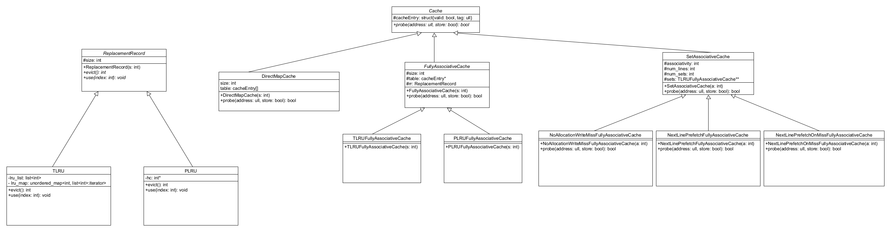

# Branch Predictor Simulator

!

## Overview

High-performance C++ simulator modeling advanced CPU cache behaviors and branch prediction strategies. Built with modern C++11 features and object-oriented design, it supports multiple cache configurations (Direct-Mapped, Fully-Associative, Set-Associative) and replacement policies (True LRU, Pseudo-LRU, Prefetching).

Ideal for benchmarking cache performance in latency-critical environments, such as trading systems and hardware optimization research.

## Data Structures

The simulator leverages modern C++ STL containers to ensure efficient cache line management, particularly in the True LRU (TLRU) implementation:

* **TLRU (True LRU) Cache Replacement Policy**

  * Uses `std::list<int>` to maintain an ordered list of cache lines based on recent usage (O(1) insert and erase from both ends).
  * Uses `std::unordered_map<int, std::list<int>::iterator>` to provide O(1) access for updating the position of cache lines within the list.
  * Combined, these structures allow constant-time updates for both cache hits and evictions, ensuring performance and scalability.

## Features

* Object-oriented design using C++ and STL containers.
* Supports multiple cache organizations:

  * **Direct-Mapped Cache**
  * **Fully-Associative Cache**

    * True LRU
    * Pseudo-LRU (PLRU)
    * No Allocation on Write Miss
    * Next-Line Prefetch
    * Next-Line Prefetch on Miss
  * **Set-Associative Cache**
* Replacement policies implemented using extendable abstract classes.

## Class Structure

### Core Classes

#### `ReplacementRecord` (Abstract)

Base class for cache replacement policies.

* `evict()`: Returns index of cache line to evict.
* `use(index)`: Marks a cache line as recently used.

##### `TLRU` (True LRU Replacement)

Uses a linked list and map for O(1) updates.

##### `PLRU` (Pseudo LRU Replacement)

Uses hot/cold bits array.

---

#### `Cache` (Abstract)

Base class for cache simulators.

* `probe(address, store)`: Simulates a memory access.

##### `DirectMapCache`

Basic direct-mapped cache with fixed-size table.

##### `FullyAssociativeCache`

Uses a `ReplacementRecord` to manage line replacement.

###### Specialized Fully Associative Variants:

* `TLRUFullyAssociativeCache`
* `PLRUFullyAssociativeCache`
* `NoAllocationWriteMissFullyAssociativeCache`
* `NextLinePrefetchFullyAssociativeCache`
* `NextLinePrefetchOnMissFullyAssociativeCache`

##### `SetAssociativeCache`

Combines set-based partitioning with fully-associative replacement within each set.

---

## Usage

### Build

```bash
make cacheSim
```

### Run

```bash
./cacheSim < trace_file.txt
```

Reads memory access traces from standard input and outputs cache hit/miss statistics for all supported configurations.

### Trace Format

```
<S|L> 0x<hex-address>
```

* `S`: Store
* `L`: Load

---

## Example Output

```
  89.452% - direct map 1KB
  91.233% - set assoc 4 prefetch
Best hit rate: 91.233%
```

## Dependencies

* C++11 or higher
* Standard Template Library (STL)
